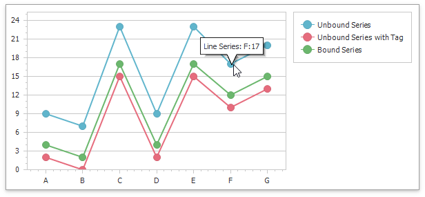
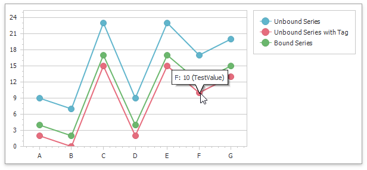
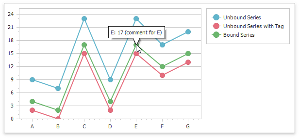

<!-- default badges list -->

<!-- default badges end -->

# Chart for WinForms - Show and Customize Chart Tooltips

This example demonstrates how to enable and customize chart tooltips at runtime. 

To enable tooltips, set the [ChartControl.ToolTipEnabled](https://docs.devexpress.com/WindowsForms/DevExpress.XtraCharts.ChartControl.ToolTipEnabled) property to `true`. 

Specify the tooltip display text in the [ToolTipPointPattern](https://docs.devexpress.com/CoreLibraries/DevExpress.XtraCharts.SeriesBase.ToolTipPointPattern) property.

## Example Structure

The following example shows tree series with different tooltip patterns:

*  `unboundSeries` - a simple unbound series.

   The series shows tooltips with the following pattern: `Line Series: {A}:{V}`

    

* `unboundSeriesWithTag` - an unbound series with the specified [SeriesPoint.Tag](https://docs.devexpress.com/CoreLibraries/DevExpress.XtraCharts.SeriesPoint.Tag) property for each data point.

    The series shows tooltips with the pattern that references `Tag` values: `{A}: {V} ({Test})`

    

* `boundSeries` - a series that is bound to the data source.

    The series shows tooltips with the pattern that references data source field values: `{A}: {V} ({Comment})`

    

## Files to Look At

* [Form1.cs](./CS/TooltipCustomization/Form1.cs) (VB: [Form1.vb](./VB/TooltipCustomization/Form1.vb))

## Documentation 

* [Charts - Series](https://docs.devexpress.com/WindowsForms/6167/controls-and-libraries/chart-control/series?p=netframework)
* [Charts - Tooltip](https://docs.devexpress.com/WindowsForms/11977/controls-and-libraries/chart-control/end-user-features/tooltip-and-crosshair-cursor/tooltip)

## More Examples

* [How to show series labels for hot-tracked points](https://github.com/DevExpress-Examples/how-to-show-series-labels-for-hot-tracked-points-e2483)
* [How to accompany a chart, its pane or series point by text or image annotations](https://github.com/DevExpress-Examples/how-to-accompany-a-chart-its-pane-or-series-point-by-text-or-image-annotations-e2188)
<!-- feedback -->
## Does this example address your development requirements/objectives?

 

(you will be redirected to DevExpress.com to submit your response)
<!-- feedback end -->
